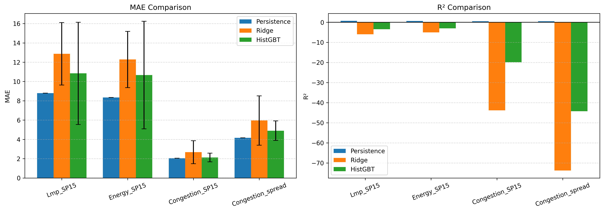
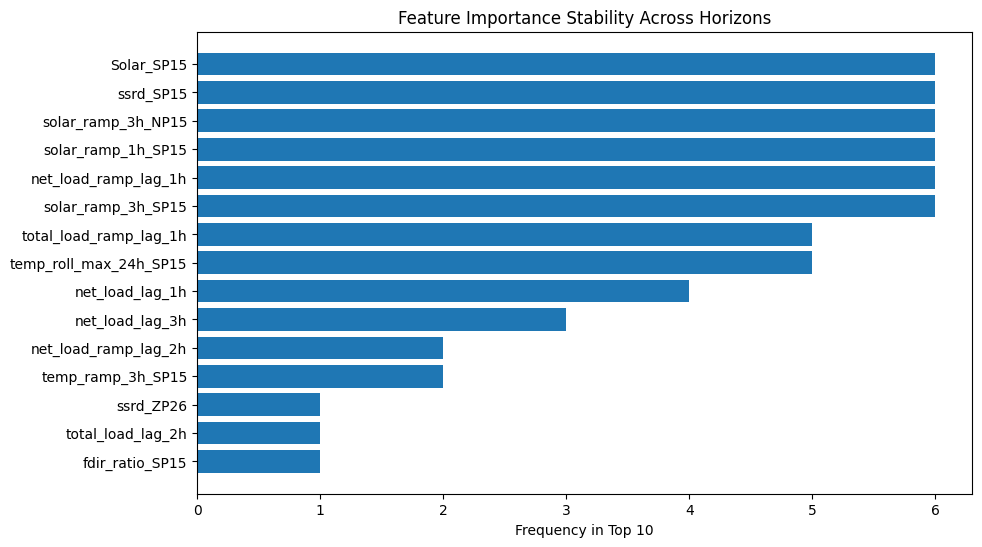
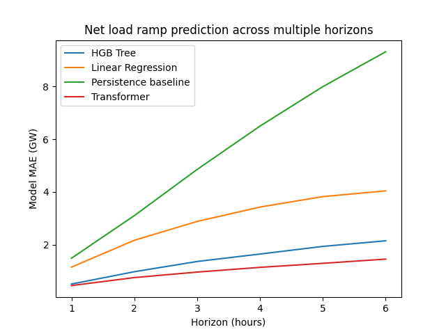

# Key Findings

- Weather alone has little predictive power for locational marginal
  pricing (LMP) and its components (congestion, energy cost).

- Calendar regimes capture most of the available signal in this setup
  when forecasting congestion spikes

- Net load ramp is substantially weather driven, with nonlinear temporal
  structure. A transformer model improves on the performance of an HGB
  tree at all horizons in the 1-6h range, with the performance gap
  widening at longer horizons.

# Setup

California Independent System Operator (CAISO) was used as the primary
data source for energy market data. From CAISO, via the gridstatus API,
LMP per hub (SP15, NP15, and ZP26) was obtained, as well as regional
load and fuel mix generation data, from 2023-01-01 to 2026-01-01. These
were preprocessed to 1h resolution. 2023 and 2024 were used for
training, and 2025 was held out for testing.\
ERA5 hourly weather data was obtained from CDS, including ssrd, fdir,
tcc, tp, t2m, and tcwv. The nearest ERA5 cell to each CAISO hub was
identified, and a spatial average over a 3x3 ERA5 patch was taken for
each variable.\
In addition to the raw weather features, lag and rolling window features
were computed, as well as time features which included sin/cos encodings
of hour of day, day of year, and day of week.

# Results

## LMP and its components

We initially attempted to regress LMP, as well as two of its
components - energy cost, and congestion, for the SP15 Southern
California hub, from weather and time features. We also examined the
congestion spread between Northern and Southern California. Across all
targets, we found that a simple persistence baseline performed best,
indicating that weather is not a direct driver of LMP. This in turn
constrains where weather-based modeling can add value.

<figure data-latex-placement="!htbp">

<figcaption>Direct Regression of LMP Components</figcaption>
</figure>

## Congestion Spikes

We then forecast 24-h ahead congestion spikes from time and weather
features. The time features included hour of day, and month. Year and
any absolute time features were excluded to prevent the model from
memorizing incidents. While weather features improved the performance of
the linear model, tree-based models performed better with temporal
features alone. This implies that congestion spikes are calendar regime
events, rather than weather-driven anomalies. We report the ROC-AUC for
logistic regression and an HGB classifier across three different feature
sets below.

:::: center
::: {#tab:congestion-spikes}
  **Model**              **No Weather**   **Weather, No Lag**   **Weather + Lag**
  --------------------- ---------------- --------------------- -------------------
                                                               
  Logistic Regression        0.731               0.777                0.801
  HGB Classifier             0.793               0.789                0.789

  : ROC-AUC for 24-h ahead congestion spike classification (SP15).
:::
::::

## Net load ramp forecasting

Net load represents the demand that must be met after wind and solar
generation are accounted for. It is computed as load - (wind
generation + solar generation). Changes, or ramping, in net load
directly affect reserve needs and grid reliability. Load and generation
are reported over the entire region, not per hub. Similar to
[@yurdakul2021forecasting], we forecast the change in load over 1h-6h
horizons, and found that this is a case where weather drives the
dependent variable. Moreover, the relationship is driven by nonlinear
temporal structure in the weather signal. An HGB tree significantly
outperformed both a persistence baseline and a linear regression model.
In addition, we found that lag features consistently appeared in the top
20 when decomposing feature importance, which motivated the extension to
a transformer approach in the next experiment.

<figure data-latex-placement="!htbp">

<figcaption>HGB Tree Feature Importance Across Horizons</figcaption>
</figure>

## Net load ramp temporal modeling with transformers

An encoder-only transformer with simple sin/cos positional embeddings,
trained on a 168h (1 week) input window was employed to explore whether
there are more complex nonlinear relationships in the time series
weather data than a tree model could exploit. As there were only three
hubs in this experiment, there was little spatial structure to exploit,
so the experiment focused solely on temporal signal. The transformer
outperformed the HGB tree at all horizons, but the performance gap
widened noticeably as horizon length increased. This suggests that
complex, nonlinear long-range dependencies are present, and are not
sufficiently captured by lag features alone. We report MAE in GW across
6 horizons below for the full suite of models.

:::: center
::: {#tab:ramp-mae}
  **Model**            **1h**   **2h**   **3h**   **4h**   **5h**   **6h**
  ------------------- -------- -------- -------- -------- -------- --------
                                                                   
  Persistence          1.491    3.106    4.856    6.450    7.996    9.317
  Linear Regression    1.153    2.171    2.886    3.431    3.827    4.045
  HGB                  0.512    0.980    1.368    1.650    1.939    2.153
  Transformer          0.455    0.758    0.966    1.146    1.298    1.458

  : Net load ramp MAE (GW) by forecast horizon.
:::
::::

<figure data-latex-placement="H">

<figcaption>Comparison of Models Across Horizons</figcaption>
</figure>

# Interpretation

The results reveal a clear asymmetry between the role of weather in the
physical and market layers of the power system. Market outcomes in the
day-ahead setting (LMP, congestion, energy cost) are dominated by
temporal and institutional structure - transmission limits, bidding
structure, grid topology, etc - and weather adds little useful signal.
The physical layer (load, net load ramp) is weather-driven, and the
relationship is defined by nonlinear temporal dynamics. This suggests
that weather is a useful input for forecasting system state, but not a
sufficient signal for down- stream market outcomes, which rely on
context beyond the physical layer. In this study we utilized only
historical weather reanalysis data, to avoid the uncertainty introduced
by forecast weather, but from this, we can hypothesize that downstream
models incorporating weather forecasts might be better served by
conditioning on weather-forecast-driven system state rather than raw
weather forecast data.

# Future Directions

- Learn a structured intermediate state representation which feeds into
  downstream market forecasting models. Weather does not fully determine
  the intermediate system state, but when coupled with grid constraints
  such as outages, transmission limits etc, a learned latent
  representation could provide a spatially dense and far richer input to
  downstream market layer forecasting models than load or generation,
  which are spatially coarse and incomplete projections of the drivers
  of market dynamics.

- Incorporate Weather forecasts - this study intentionally restricted
  the weather inputs to historical reanalysis data to avoid the
  uncertainty introduced by forecast weather. In practice, however,
  day-ahead market forecasting typically relies on forecast weather
  data. A natural extension of this study would be to quantify
  introduced uncertainty from weather forecasts, derive forecast system
  state from weather forecasts and compare effectiveness of conditioning
  on weather forecasts vs weather-driven system state forecasts.

- Multi-modal inputs and outputs - expanding to more than just weather
  data, as weather is not the primary driver in a lot of these cases.
  Deep learning makes more sense as the complexity of interactions
  increases, both in the input and output layers.
